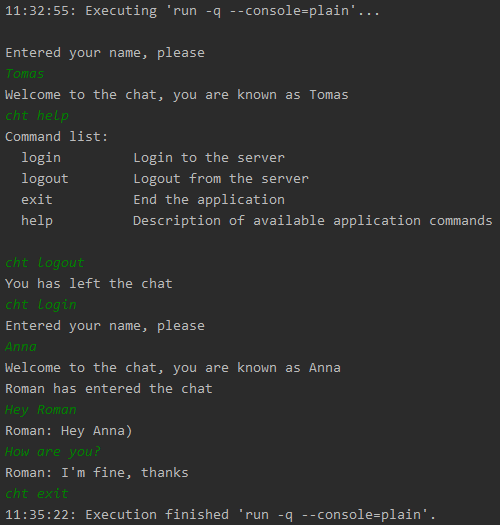
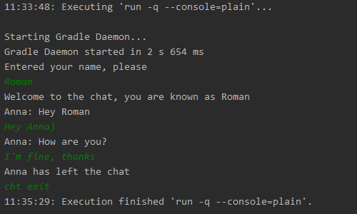
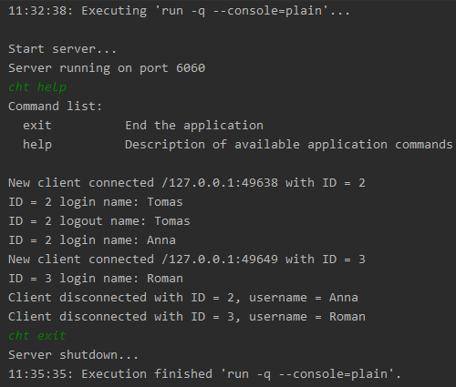

# MultiplayerSocketChat
__MultiplayerSocketChat__ is a simple multiplayer socket chat. __MultiplayerSocketChat__ starts and runs on the command line.
When implementing the chat, the following tasks were solved:
- demonstrate the organization of a multi-module project using gradle;
- implement a client-server application running in one thread;
- implement data exchange over sockets;
- implement simple communication protocols between client and server;

## How does it work
Once started, the chat server waits for clients to connect. The client, in turn, after connecting to the server, passes authorization, and then can exchange messages with other clients.

The chat client and server are controlled by commands from the console. Every command starts with `cht` prefix. All other entered data (without prefix) are defined in the client as messages for other clients. A list of commands can be obtained using the command `cht help`.

## How to run
Starting the server from the command line:
```bash
./gradlew chat-server:run -q --console=plain
```

Launching the client from the command line:
```bash
./gradlew chat-client:run -q --console=plain
```

## Work example
First client:



Second client:



Server:



